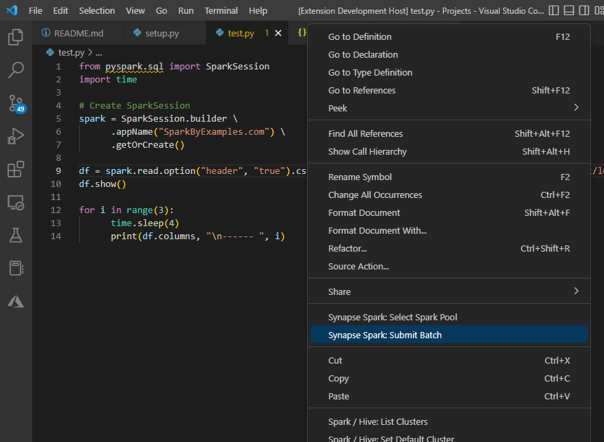

# synapse-spark-tools README

Provides the ability to submit PySpark batch jobs to Azure Synapse Spark pools.

## Features

Submit PySpark batch jobs to Synapse clusters by using the context menu. 



## Requirements

Requires [Azure CLI](https://learn.microsoft.com/en-us/cli/azure/install-azure-cli). Install Azure CLI and login with `az login`

## Extension Settings

This extension contributes the following settings:

* `synapse-spark.subscriptionId`: Set the Azure Subscription that contains your resources.
* `synapse-spark.workspace`: Set the Synapse Workspace for job submission.
* `synapse-spark.resourceGroupName`: Set the Azure Resource GRoup that contains your Synapse Workspace.
* `synapse-spark.adlsTempAccount`: Set the Azure Storage Account to use to upload the file to submit.
* `synapse-spark.adlsTempContainer`: Set the Azure Storage Account Container to use for file uploads.
* `synapse-spark.adlsTempPath`: Set the path in the Azure Storage Account Container to use for file uploads.
* `synapse-spark.cluster`: Set the Spark pool to use for job submissions.
* `synapse-spark.batchJobOptions`: Set the Spark Batch Job Options to use when submitting jobs.

`synapse-spark.batchJobOptions` must be configured in your workspace settings manually. Example:
```
  "synapse-spark": {
    "batchJobOptions": {
      "tags": null, //{}
      "artifactId": null, //str
      "className": "", //str
      "arguments": null, //arr
      "jars": null, //arr
      "pythonFiles": [],
      "files": null, //arr
      "archives": null, //arr
      "configuration": null, //{}
      "driverMemory": "4g", //str
      "driverCores": 2, //int
      "executorMemory": "4g", //str
      "executorCores": 2, //int
      "executorCount": 2 //int
    }
  },
```

The other configuration settings can be configured individually using the command palette or all at once by selecting `Configure All` from the command palette.

## Known Issues

N/A

## Release Notes

### 0.0.1

Initial release of Synapse Spark Tools
- Submit PySpark Batch jobs via the context menu
